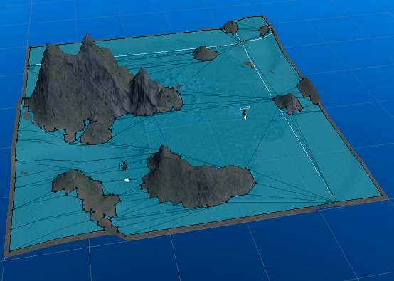

## NavMeshについて　設定手順とか

- 歩く部分をNavigation Staticにする。
Navigation StaticはInspectorInspectorのStaticにて  

- Navigation画面を開く
NavigationはUnityツールバーのWindow > AI > Navigation  
versionによって変わるイメージ（やめてくれ）  

- Navigation設定を行う
歩かせたくない場所はNot walkable  
歩かせたい場所はWalkable  
とかにする。  

- 設定
Bakeタブを開いて、Bakeボタンをタップ。  
歩ける場所は色が水色となる。  
  

- NPC設定
NPCのGameObectにNav Mesh Agentをアタッチする。  

- Nav Mesh Agentのプロパティについて
[Unity ナビメッシュエージェント](https://docs.unity3d.com/ja/current/Manual/class-NavMeshAgent.html)  

