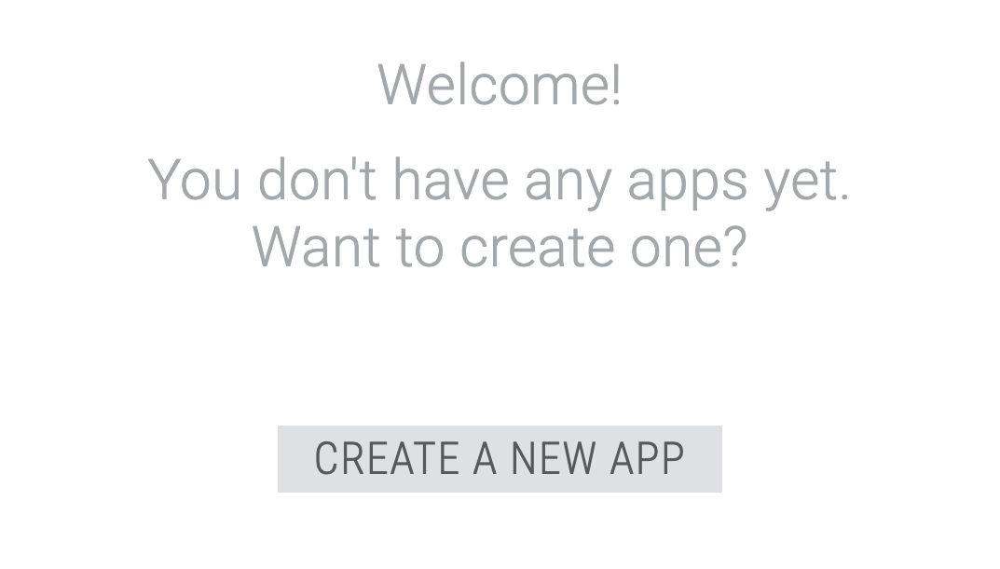
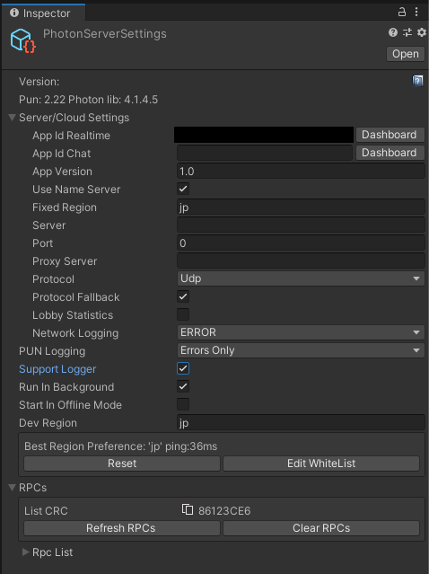

## 目的
PUN 2(photon unity network 2)というネットワークで多人数と同期ゲームができる  
アセットの導入部分のメモ

## 参照サイト
この記事内のことは、以下の公式サイトでやっていることのまとめです。  
[PUN2で始めるオンラインゲーム開発入門【その１】](https://connect.unity.com/p/pun2deshi-meruonraingemukai-fa-ru-men-sono1?)  

## 公式サイトにてユーザ登録
(https://www.photonengine.com/)[https://www.photonengine.com/]  
にアクセス。  
`TRY PHOTON FREE`をクリック。  
メアド登録後、メールを確認。  
メールよりパスワード選択画面に誘導されるので、登録。  
  
## アプリ登録
ユーザ登録後、以下画面に遷移する。  
`CREATE A NEW APP`でアプリ登録へ  

  
Photon Typeについて、  
とりあえずデフォルトの「Photon Realtime」としました。  
似たような機能で「Photon PUN」があるようで、性能や有料にした場合の価格が違うようですが、、PUNの方が高機能的な記述も見ました。  
Nameとかは適切に。  
  

登録後は、表記されたAPP IDをメモします。  
  
  
## アセットストアでインポート
アセットストアにて「PUN 2 無料版」をインポートします。  
  
  
先程メモしたAppidを入力します。  
  
  
Inspectorの値は以下にした。参照サイトを参考に。  
  
GameObjectという空のオブジェクトを作り、「SampleScene」というスクリプトを作成します。  
スクリプトの内容は参照サイトと全く一緒なので、そちらにて。  
  
次にAssetsフォルダ配下に「Resources」フォルダを作り、「GamePlayer」というオブジェクトを作ります。  
  
名前とか違うとエラーになりました。  
  
GamePlayerの設定も参照サイトとほぼ同じです。  
  
UnityのFileメニューより「Build And Run」を実行して、アプリを起動します。  
  
  
次にUnityの「Play」ボタンを実行します。  
そうすると先程実行したアプリにもう一つオブジェクトが追加されています。  
  
一応、これでマッチングができていると思います。  
移動できて、それぞれ違う動き出来たらもっと分かりやすいですね。  
  
