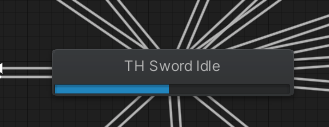
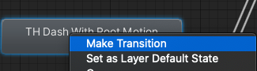

## 目的
キャラクターに既存のアニメーションを追加設定して、「SPACE」キーをタップした時そのアニメーションを実行するようにする時の手順メモ  
※アニメーションについては、入手したAssetに付いているものを利用します。ここではアニメーションの作成方法は記載していません。  
  

## 環境
- Mac OS
- Unity version 2019.4.10f1

## Animator画面について
Unityの「Window」メニューより「Animation」→「Animator」を選択します。  
  

Animator画面が表示されます。  
冒頭にも記載しましたが、すでにアニメーション(Animator)設定されているAssetのPrefabキャラクターを利用しています。  
  
  
この状態で一旦アプリを実行します。  
そうすると、以下のようにゲージが表示されているステートメントがあることが分かります。  
  

以下の場合、「TH Sword Idle」ステートメントが標準で実施されている状態です。  

  
今回は「TH Sword Idle」ステートメントから「TH Dash Without Root Motion」に状態を遷移させたいと思います。  

  

## トランザクションについて
起動時のステートメント「TH Sword Idle」と遷移させたいステートメント「TH Dash Without Root Motion」が決まったら、それを結ぶトランザクション（矢印⇄の事）をクリックします。  
画面右のConditions欄に「TH Sword Dash」が「true」となっていることが確認できます。  

 
  
ちなみに上記では、既にトランザクションが設定されています。設定されていない場合はステートメントを右クリックすることでトランザクションを設定できます。  

 
  
ということで、「TH Sword Dash」をtrueにすると、「TH Sword Idle」ステートメントから「TH Dash Without Root Motion」に遷移できることが分かります。  

## プログラムでトランザクションを設定
次にプログラムで「TH Sword Dash」をtrueにする設定を行います。  
まず、キャラクターにScriptコンポーネントを追加します。  

 

Scriptコンポーネントの内容は以下とします。  
UnityやC#にそこまで精通していないので、書き方お作法違ったらスミマセン。  

public class PlayerScript : MonoBehaviour
{
   Animator animator;
   bool flagDash;
   // Start is called before the first frame update
   void Start()
   {
       animator = GetComponent<Animator>();
       flagDash = false;
   }
   // Update is called once per frame
   void Update()
   {
       if (Input.GetButtonDown("Jump"))
       {
           flagDash = !flagDash;
           animator.SetBool("TH Sword Dash", flagDash);
       }
       if (flagDash)
       {
           transform.position += transform.forward * Time.deltaTime * 5;
       }
   }
}

Start()で  
アタッチしているキャラクターのAnimatorを取得。  
フラグ設定・flagDashがtrueの時ダッシュ！  
Update()で  
Jumpキー＝「SPACE」キーをタップするとフラグ変更とAnimatorにある「TH Sword Dash」をフラグの通りに。  
ダッシュ中はキャラクターを移動させる。  
  
Time.deltaTimeとかなんぞ！？という方は冒頭の参照リンクを見てください。  
  

## 確認
準備が出来たので、アプリを実行します。  

