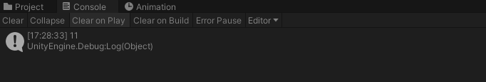
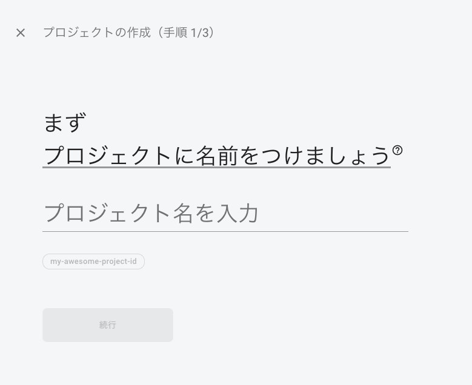
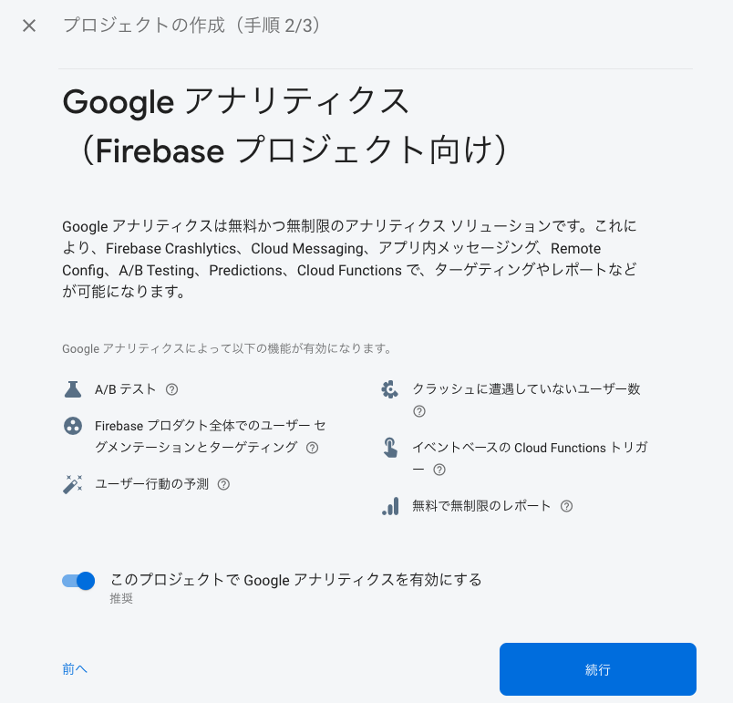
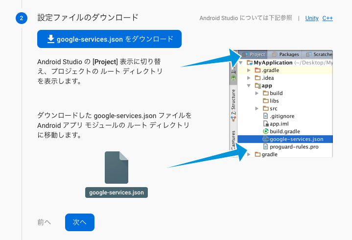
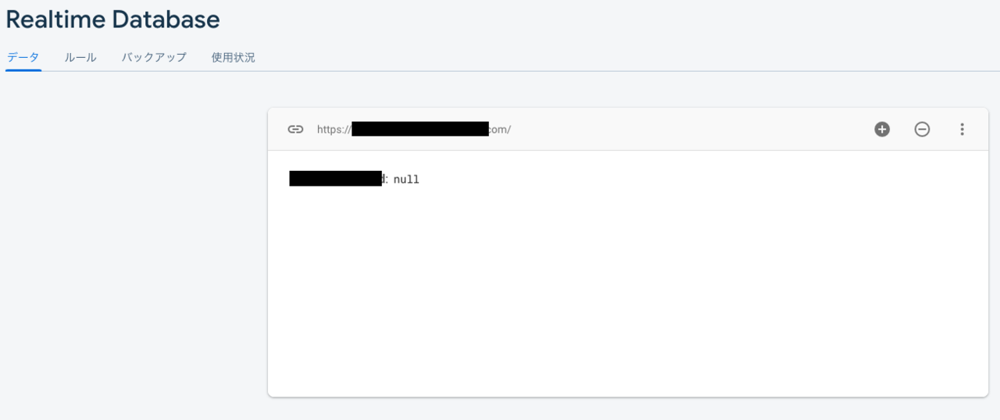

## はじめに
FirebaseRealtimeにて設定したデータベースを、UnityのC#プログラムで取得する方法です。  
  
  
  
## 公式ドキュメント
Googleによる公式ドキュメントは以下となります。  
(Unity プロジェクトに Firebase を追加する)[https://firebase.google.com/docs/unity/setup?hl=ja]  
(Unity の Firebase Realtime Database を使ってみる)[https://firebase.google.com/docs/database/unity/start?hl=ja]  
  

## 環境について
各ツールのバージョン要件は以下となります。  
- Unity 5.3 以降
- Xcode 9.4.1 以降
- CocoaPods 1.4.0 以降
- iOS 8 以降
- Android API レベル 16 以降  
  
またこの記事ではMacOSでの手順となります。  
  

## Firebase プロジェクトを作成
ブラウザより、Firebaseに接続して、アプリを登録します。  
(Firebase)[https://console.firebase.google.com/u/0/?hl=ja]  
  
  
  
  

## アプリを登録して構成ファイルをダウンロード
引き続きFirebaseにて、アプリを登録します。  
登録後にダウンロードできる構成ファイルが必要になります。  
iOSかAndroidどちらかを登録しないと、Firebaseからデータを取得できないように見受けられました。  
今回はAndroidアプリを登録しました。  
  
FirebaseコンソールよりAndroidプラットフォームを選択。  
  
  
アプリのパッケージ名を決めて、設定する必要があります。  
ちなみに、、後から名前は変更できないようです。  
削除して新しく追加は可能なようです。  
  
  
構成ファイルをダウンロードしたら、ココの手順は終わりにしました。  
「Firebase SDKの追加」・「アプリを実行してインストールを確認」は行っておりません。  
  
ダウンロードした構成ファイル「google-services.json」は  
Unityプロジェクトの「Assets」フォルダ配下の「StreamingAssets」フォルダ配下に設置。  
「StreamingAssets」フォルダは自分で作成しました。  
  
※StreamingAssets配下に構成ファイルが無いというエラーが出たので、このようにしました。  
  

## Firebase Unity SDK を追加
次に、  
(SDKファイル)[https://firebase.google.com/download/unity?hl=ja]  
よりFirebase Unity SDKをダウンロードして、解凍します。  
2Gほどのサイズがあります。  
  
ダウンロード後は、Unityより  

[Assets] > [Import Package] > [Custom Package]

を選択後、dotnet4/FirebaseDatabase.unitypackageを選択して、インポートします。  
ちなみにdotnet3フォルダもありますが、donet4フォルダのものを選択しました。ご注意ください。  
Unity 5.x 以前ではの場合、dotnet3フォルダを利用するようです。  
  
## データベースを作成
ここからはRealtime Databaseにて実際にデータベースを作成します。  
ブラウザより、Firebase コンソールの [Realtime Database] セクションに移動します。  
  
  
「データベースを作成」をクリックします。  
Realtime Database のセキュリティ ルールでは「テストモード」を選択し、「有効にする」ボタンをクリックします。  
テストモードとロックモードの違いは以下となります。  
  

テストモード
モバイルおよびウェブ クライアント ライブラリを使用する場合に適していますが、すべてのユーザーがデータを読み書きできます。
ウェブ、iOS、Android SDK を使用する場合は、テストモードを選択します。

ロックモード
モバイルおよびウェブ クライアントからのすべての読み書きを拒否します。認証されたアプリケーション サーバーは引き続きデータベースにアクセスできます。

  
テストモードの設定については、  
(Firebase Realtime Database ルールについて)[https://firebase.google.com/docs/database/security?hl=ja]  
も参照してください。  
  
Realtime Databaseページが表示され、以下のように表記されています。  
  
  
データの横にカーソルを移動すると、「＋」ボタンが表示されるので、以下のように設定しました。  
  
  

## プログラムにて設定したデータを取得
UnityにてC#プログラムでRealtime Databaseで設定したデータを取得します。  

// Set this before calling into the realtime database.
FirebaseApp.DefaultInstance.SetEditorDatabaseUrl("https://YOUR-FIREBASE-APP.firebaseio.com/");

FirebaseDatabase.DefaultInstance
   .GetReference("test")
   .GetValueAsync().ContinueWith(task => {
   if (task.IsFaulted) {
       // Handle the error...
   }
   else if (task.IsCompleted) {
       DataSnapshot snapshot = task.Result;
       // Do something with snapshot...
       Debug.Log (snapshot.Value);
   }
   });

  
FirebaseApp.DefaultInstance.SetEditorDatabaseUrl("https://YOUR-FIREBASE-APP.firebaseio.com/");  
の「https://YOUR-FIREBASE-APP.firebaseio.com/」にはRealtime Databaseページのリンク（上の画像で黒塗りしている部分）を設定します。  
GetReference("test")で名前を指定します。  
  
上記の設定を行うことで、snapshot.Valueより「11」の値が取得できます。  
  
  
  
説明は以上です。  
  
