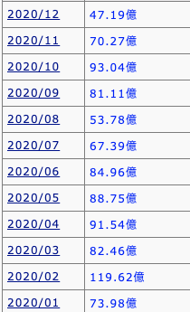

## 鬼滅の刃2期が2021年に
鬼滅の刃2期の放送が決定しました。  
ということで、過去にコラボして売上が倍増した
`モンスト`・`パズドラ`ともに今年も安定かなという気になったことです。  
  
## モンストの鬼滅の刃コラボ時の売上
正しい売上ではないが、参考として  
モンストでは2020年2月ごろ、鬼滅とコラボ。  
その月は売上倍増。翌月も好調。  

参照元 :   
ゲーム株『Game-i』/ モンスターストライク  
http://game-i.daa.jp/?%E3%82%A2%E3%83%97%E3%83%AA/%E3%83%A2%E3%83%B3%E3%82%B9%E3%82%BF%E3%83%BC%E3%82%B9%E3%83%88%E3%83%A9%E3%82%A4%E3%82%AF  
  
  
## パズドラの鬼滅の刃コラボ時の売上  
こっちも正しい売上ではないが、参考として  
パズドラでは2020年10月末に、鬼滅とコラボ。  
10月は微増で翌月に倍増。  
パズドラの売上は月で安定していないのではっきり言えないが、取り敢えずその翌月も好調。  

参照元 :   
ゲーム株『Game-i』/ パズル＆ドラゴンズ  
http://game-i.daa.jp/?%E3%82%A2%E3%83%97%E3%83%AA/%E3%83%91%E3%82%BA%E3%83%AB%EF%BC%86%E3%83%89%E3%83%A9%E3%82%B4%E3%83%B3%E3%82%BA  
  

## コラボについて
コラボはそのアプリの世界観壊すから辞めたほうが良いと思うんだけど、正義なんだなって。  
